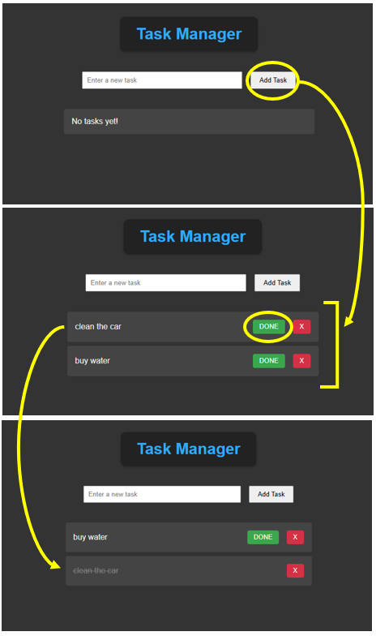

# Project: Personal Task Manager (CLI-Based)
A simple command-line task manager to add, list, complete, and delete tasks.

 <br/>

## Features:
✅ **Add Tasks** – Store tasks with due dates \
✅ **List Tasks** – Show pending and completed tasks \
✅ **Complete Tasks** – Mark tasks as done \
✅ **Delete Tasks** – Remove tasks when no longer needed \
✅ **Data Persistence** – Save tasks in a JSON file \
✅ **Web UI** - For visualization and live updates via page reload 

## Folders Structure:
```
task_manager/
│── app.py                   # Main Flask app
│── routes/
│   └── task_routes.py       # Task-related routes
│── utils/
│   └── task_manager.py      # Task loading & saving logic
│── templates/
│   └── index.html           # HTML for visualization
│── static/
│   └── style.css            # CSS style
└── tasks.json               # Stores tasks
```
## CLI Steps:
1️⃣ Run: ```pip install flask``` \
2️⃣ Start the server with: ```python3 task_manager/app.py```
